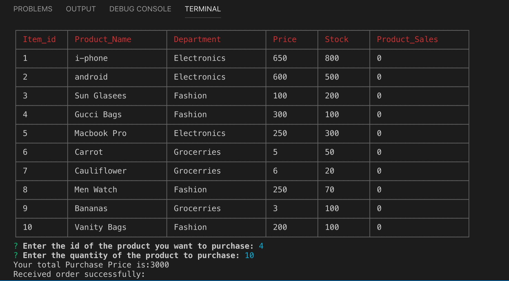
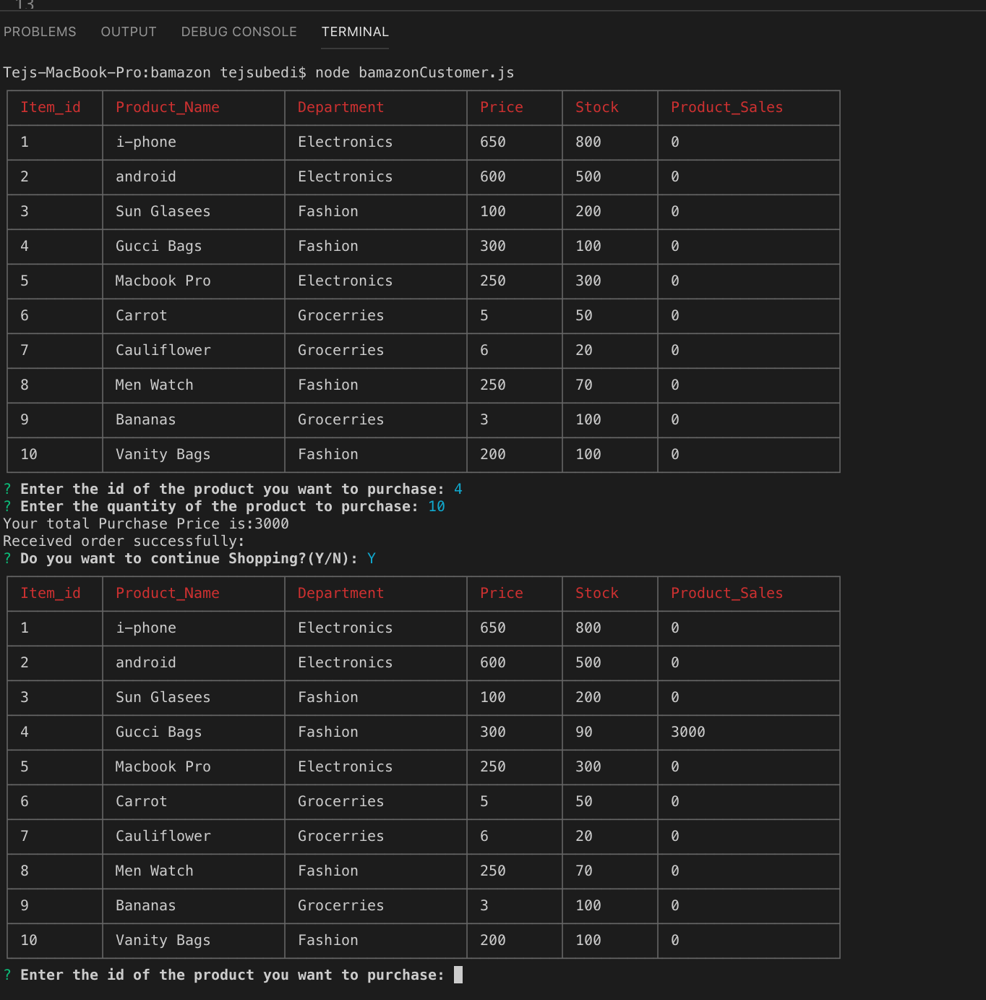
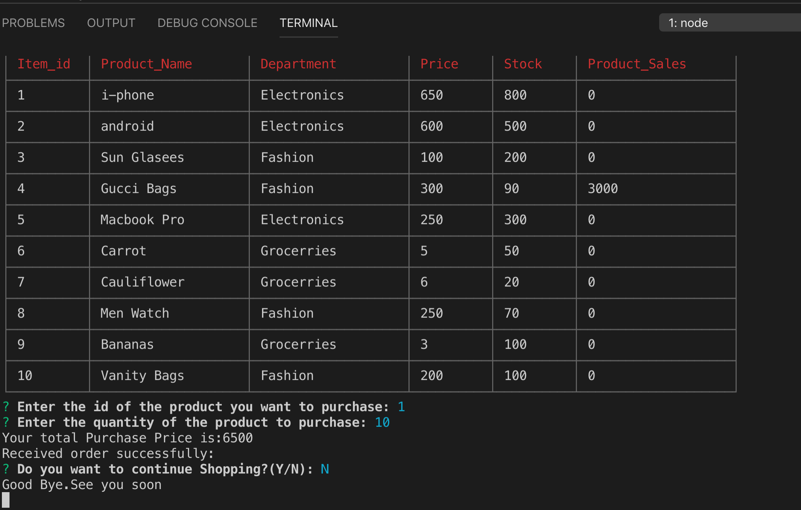
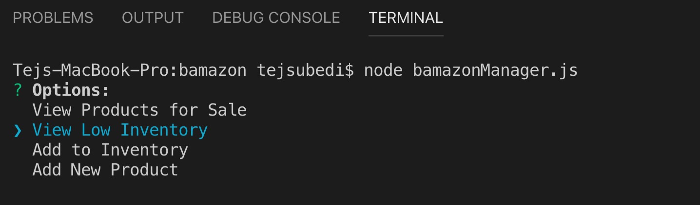

# bamazon

#Packages added to the file
**install the npm mysql for database**
**install the npm inquirer for prompt the message**
**install the npm cli-table for table head in console**
**added .gitignore file**

# Purpose of this project

This project is about to get more familiar with the MySql database where we can create our database and update it's data as amazon stock application developed using node.The app will take in orders from customers and delete stock from the store's inventory.  

# How to operate
**To operate this project it will take some of the commands from command prompt are as follows:**
* `node bamazonCustomer.js`

* `node bamazonManager.js`

* `node bamazonSupervisor.js`

## What each command should do 

**1.`node bamazonCustomer.js` will genereate in terminal**

* Running this application will first display all of the items available for sale. Include the ids, names, and prices of products for sale.

* The first should ask them the ID of the product they would like to buy.
* The second message should ask how many units of the product they would like to buy.

#Image -1

#Image -2

#Image -3

**2.`node bamazonManager.js` will genereate in terminal**

* Running this application will:
    * List a set of menu options
    * View Products for Sale
    * View Low Inventory
    * Add to Inventory
    * Add New Product

#Image -1 

